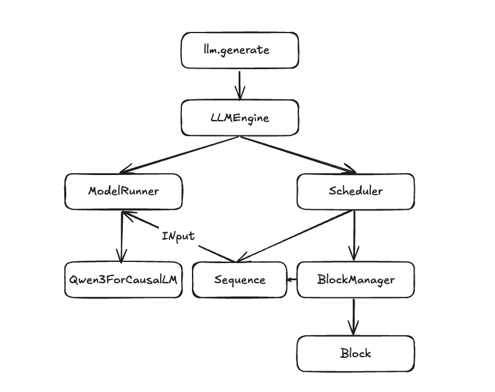
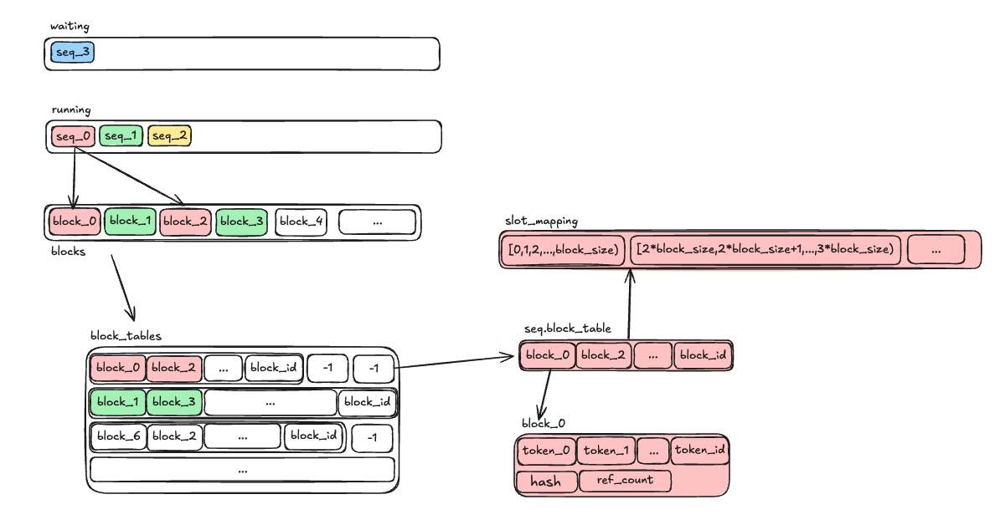

# nano-vllm

vllm作为当前llm serving framework的最佳实践之一，学习其源码能帮助加深LLM Inference优化的理解，但其日渐庞杂的代码量，难免会让读者望而生畏。而nanovllm用更轻量级的代码实现其核心功能，这对帮助理解vllm大有裨益，同时，如有特定需求，基于nano-vllm去二次开发特定需求的llm framework相信也更加容易

- nano-vllm：[https://github.com/GeeeekExplorer/nano-vllm](https://github.com/GeeeekExplorer/nano-vllm)
- 注释版：[https://github.com/sunkx109/nano-vllm](https://github.com/sunkx109/nano-vllm)

```xml
├── bench.py
├── example.py
├── LICENSE
├── nanovllm
│   ├── config.py
│   ├── engine
│   │   ├── block_manager.py
│   │   ├── llm_engine.py
│   │   ├── model_runner.py
│   │   ├── scheduler.py
│   │   └── sequence.py
│   ├── __init__.py
│   ├── layers
│   │   ├── activation.py
│   │   ├── attention.py
│   │   ├── embed_head.py
│   │   ├── layernorm.py
│   │   ├── linear.py
│   │   ├── rotary_embedding.py
│   │   └── sampler.py
│   ├── llm.py
│   ├── models
│   │   └── qwen3.py
│   ├── sampling_params.py
│   └── utils
│       ├── context.py
│       └── loader.py
├── pyproject.toml
└── README.md
```

整个nano-vllm的架构示意图如下所示，LLMEngine作为推理入口，其成员分别有ModelRunner与Scheduler，ModelRunner负责具体模型(Qwen3)的推理执行，而Scheduler负责调度具体Seqs的Prefill与Decoding，同时通过BlockManager来为具体Seqs对应的KVBlock进行具体的管理



## LLMEngine

- `__init__`

  LLMEngine的成员包含`Scheduler` 与`ModelRunner`

  ```python
  		def __init__(self, model, **kwargs):
          config = Config(model, **config_kwargs)
          ...
         
          self.model_runner = ModelRunner(config, 0, self.events)
          self.tokenizer = AutoTokenizer.from_pretrained(...)
          config.eos = self.tokenizer.eos_token_id
          self.scheduler = Scheduler(config)
  ```

这个类主要关注以下几个方法：

- `generate`

  这个是向外暴露的接口方法，也在example里面会直接调用到的方法，由这个方法开始LLM的推理

- `add_request`

  将当前Sequence添加到scheduler的waiting 队列

- `step`

  ```python
      def step(self):
          seqs, is_prefill = self.scheduler.schedule()
          token_ids = self.model_runner.call("run", seqs, is_prefill)
          self.scheduler.postprocess(seqs, token_ids)
          outputs = [(seq.seq_id, seq.completion_token_ids) for seq in seqs if seq.is_finished]
          num_tokens = sum(len(seq) for seq in seqs) if is_prefill else -len(seqs)
          return outputs, num_tokens
  ```

## Scheduler

- `__init__`函数

  scheduler会维护两个双端队列`deque` ：waiting队列存还未运行的`Sequence`  和 running队列存正在执行的`Sequence` ； 还有一个`BlockManager` 用来管理KV cache Block

  ```python
     def __init__(self, config: Config):
          self.max_num_seqs = config.max_num_seqs
          self.max_num_batched_tokens = config.max_num_batched_tokens
          self.eos = config.eos
          self.block_manager = BlockManager(config.num_kvcache_blocks, config.kvcache_block_size)
          self.waiting: deque[Sequence] = deque()
          self.running: deque[Sequence] = deque()
  ```

Scheduler Class需要主要关注的方法：

- `is_finished`

  判断任务是否完成，如果running队列与waitting队列都为空，则已完成，否则未完成

- `add`

  将当前`seq` 添加至waiting队列尾部

- `preempt`

  抢占当前seq的资源，即将当前这个正处在running队列的seq更改为waiting状态，并打回waiting队列，同时销毁seq的block，这就意味着后续在对这个seq的处理就得从头开始

- `postprocess`

  将当前的token_id添加到对应seq后面，如果此seq满足结束条件就Finish同时释放block资源

- `schedule`

  核心调度逻辑方法

  ```python
      def schedule(self) -> tuple[list[Sequence], bool]:
          # prefill
          scheduled_seqs = []
          num_seqs = 0
          num_batched_tokens = 0
          while self.waiting and num_seqs < self.max_num_seqs:
              # 当waiting队列不为空，而且处理num_seqs不超过max_num_seqs
              seq = self.waiting[0] # 取出队列首个seq
              if num_batched_tokens + len(seq) > self.max_num_batched_tokens or not self.block_manager.can_allocate(seq):
                  #如果同时批处理tokens超过最大批处理tokens，或者没有内存分配
                  break
              num_seqs += 1
              self.block_manager.allocate(seq) # 给seq分配block
              num_batched_tokens += len(seq) - seq.num_cached_tokens # num_batched_tokens
              seq.status = SequenceStatus.RUNNING # 更改状态
              self.waiting.popleft() #从waiting队列出
              self.running.append(seq) #进running队列
              scheduled_seqs.append(seq) # 同时标记为被调度的seq
          #优先处理waiting队列直到不能处理后返回scheduled_seqs
          if scheduled_seqs:
              return scheduled_seqs, True
  
          # decode
          
          while self.running and num_seqs < self.max_num_seqs:
  		        # 当running队列不为空，而且处理num_seqs不超过max_num_seqs
              seq = self.running.popleft() #取出running队列左侧的seq
              while not self.block_manager.can_append(seq):
                  # decoding新增的token能否直接追加
                  if self.running:
                      # running队列不为空，就抢占队列最后的seq
                      self.preempt(self.running.pop())
                  else:
                      # 否则就抢占自己
                      self.preempt(seq)
                      break
              else:
                  # 如果seq的最新的token能直接追加
                  num_seqs += 1
                  self.block_manager.may_append(seq)
                  scheduled_seqs.append(seq)
          assert scheduled_seqs
          # 保序将scheduled_seqs插入running队列前面
          self.running.extendleft(reversed(scheduled_seqs)) 
          # 这里取出又放回去的原因是因为decoding是迭代生成过程FIFO保证公平调度顺序
          return scheduled_seqs, False
    		
    		
    		def preempt(self, seq: Sequence):
          seq.status = SequenceStatus.WAITING
          # 更改seq的状态为waiting
          # 同时销毁seq的block资源，这意味这个seq即使已经经过prefill，但是现在开始也会被打回重算
          self.block_manager.deallocate(seq)
          self.waiting.appendleft(seq)
  ```

总结一下调度细节：

1. 优先处理waiting队列(即prefill)，waiting队列从左侧出，然后将此seq添加到running队列末端
2. 如果waiting队列已经空了，或者已经无法为prefill seq分配block 则开始处理decoding
3. 如果running队列无法分配block，会preempt running队列最后的seq，打回waiting队列释放block，后续重新计算这个seq 的prefill

## BlockManager

- `__init__`函数

  ```python
      def __init__(self, num_blocks: int, block_size: int):
          self.block_size = block_size
          self.blocks: list[Block] = [Block(i) for i in range(num_blocks)]
          # 记录
          self.hash_to_block_id: dict[int, int] = dict()
          self.free_block_ids: deque[int] = deque(range(num_blocks))
          self.used_block_ids: set[int] = set()
  ```

`blockmanager`维护block的一些信息，而每个block的定义也比较简单，每个block都有一个`block_id` 和这个block所对应的一系列`token_ids` ，还有就是当前block所对应的hash信息

```python
class Block:

    def __init__(self, block_id):
        self.block_id = block_id
        self.ref_count = 0 # 记录有多少seq使用到了这个block
        self.hash = -1
        self.token_ids = []

    def update(self, hash: int, token_ids: list[int]):
        self.hash = hash
        self.token_ids = token_ids

    def reset(self):
        self.ref_count = 1
        self.hash = -1
        self.token_ids = []
```

我们说回`BlockManager`，这个类需要重点关注以下方法，同时根据schedule的调度细节，不难发现，`can_allocate` 和`allocate` 方法主要针对prefill阶段的处理；而`can_append` 、`may_append` 和`preempt` 、`deallocate` 则主要针对decoding阶段会触发的处理

- `compute_hash`

  根据前一个block的hash值prefix 和当前block的`token_ids`计算哈希值

- `can_allocate`

  如果当前剩余的block≥ seq所需要的block就返回True，否则False，这个方法应该是主要针对Prefill

- `allocate` 和 `_allocate_block`

  ```python
      def _allocate_block(self, block_id: int) -> Block:
          block = self.blocks[block_id]
          assert block.ref_count == 0
          block.reset()
          self.free_block_ids.remove(block_id)
          self.used_block_ids.add(block_id)
          return self.blocks[block_id]
  ```

  ```python
      def allocate(self, seq: Sequence):
          assert not seq.block_table
          h = -1
          cache_miss = False
          for i in range(seq.num_blocks):
              token_ids = seq.block(i) # 获取i-block的token_ids
              h = self.compute_hash(token_ids, h) if len(token_ids) == self.block_size else -1
              # 查询hash_to_block_id字典，找到返回对应block_id，否则返回-1
              block_id = self.hash_to_block_id.get(h, -1)
              if block_id == -1 or self.blocks[block_id].token_ids != token_ids:
                  cache_miss = True
              if cache_miss:
                  # 如果cache未命中
                  block_id = self.free_block_ids[0] # 取出free的block_ids
                  block = self._allocate_block(block_id) # 分配这个block
              else:
                  # 如果cache命中了
                  seq.num_cached_tokens += self.block_size
                  if block_id in self.used_block_ids:
                      # 命中了且当前block正在使用中
                      block = self.blocks[block_id] # 直接取
                      block.ref_count += 1 # 引用+1
                  else:
                      # 命中，但是没有使用block
                      # 这里其实需要看一下_deallocate_block函数
                      # 释放的时候只是从used_block_ids移除，并没有清空token_ids
                      block = self._allocate_block(block_id)
              if h != -1:
                  # 如果计算的hash是有值的，这里要更新一下block与hash_to_block_id的信息
                  # 因为有可能虽然缓存命中，但是并不在used_block_ids中
                  block.update(h, token_ids)
                  self.hash_to_block_id[h] = block_id
              seq.block_table.append(block_id)
  ```

- `deallocate` 和`_deallocate_block`

  ```python
      def _deallocate_block(self, block_id: int) -> Block:
          assert self.blocks[block_id].ref_count == 0
          self.used_block_ids.remove(block_id)
          self.free_block_ids.append(block_id)
          
      def deallocate(self, seq: Sequence):
          # 翻转seq的block_table进行遍历进行释放
          for block_id in reversed(seq.block_table):
              block = self.blocks[block_id]
              block.ref_count -= 1
              if block.ref_count == 0:
                  self._deallocate_block(block_id)
          seq.num_cached_tokens = 0
          seq.block_table.clear()
  ```

- `may_append`

  1. 当seq需要重开一个block的时候，就是`% block_size==1` , 就分配一个block
  2. 当seq满了的时候，也就是`% block_size==0` ，这种情况就是取出当前tokens_id ，同时根据prefix与tokens_id 计算hash(而prefix就是上一个block的hash) ，然后更新这个满的block的hash与tokens_id等信息
  3. 其余情况就是保持当前block hash 为-1

  ```python
      def may_append(self, seq: Sequence):
          block_table = seq.block_table # 取出当前seq的block_table
          last_block = self.blocks[block_table[-1]] # 取出当前blockmanager的最后block
          if len(seq) % self.block_size == 1:
              # 需要开启一个新的block时，首先要确保上一个block的hash有值
              assert last_block.hash != -1
              # 取出free block
              block_id = self.free_block_ids[0]
              # allocate 这个block
              self._allocate_block(block_id)
              # 这个seq的block_table要附带上这个block_id
              block_table.append(block_id)
          elif len(seq) % self.block_size == 0:
              # 这个情况是当前block满了的状态
              # 首先要确保上一个block的hash是有值的
              assert last_block.hash == -1
              # 当前block的所有token_ids
              token_ids = seq.block(seq.num_blocks-1)
              # 如果block_table的长度>1 那就是倒数第二个block的hash
              # 否则就是-1
              prefix = self.blocks[block_table[-2]].hash if len(block_table) > 1 else -1
              h = self.compute_hash(token_ids, prefix) # 计算当前block的hash
              last_block.update(h, token_ids)# 更新当前block的hash与tokens_id
              self.hash_to_block_id[h] = last_block.block_id # 记录hash与block_id的映射关系
          else:
              # 其余情况下，保持last_block的hash为-1
              assert last_block.hash == -1
  ```

- `can_append`

  检查是否有足够的空闲块，只有在刚启用新块时（余数为 1）才需要至少 1 个空闲块，其他情况都不需要额外块

## ModelRunner

这个Class是整个推理Engine的重要部分，之前的Class都是上层的调度逻辑，而这个Class算是直接与推理执行挂钩，涉及到的点也很多，比如多卡TP和CUDA Graph和本文主要关注的KV Cache的显存管理问题

对于KV Cache 管理，我们主要重点关注以下方法

- `allocate_kv_cache`

  在ModelRunner的构造函数中会调用`allocate_kv_cache` 对KV cache进行预分配

  ```python
      def allocate_kv_cache(self):
          config = self.config
          hf_config = config.hf_config
          free, total = torch.cuda.mem_get_info()
          used = total - free
          peak = torch.cuda.memory_stats()["allocated_bytes.all.peak"] # 历史最高的已分配 CUDA 内存	
          current = torch.cuda.memory_stats()["allocated_bytes.all.current"] # 当前进程正在使用的已分配 CUDA 内存
          num_kv_heads = hf_config.num_key_value_heads // self.world_size # 拆分KV到不同GPU
          # 2* n_layer * n_kv_head * block_size * head_dim * dtype_size
          block_bytes = 2 * hf_config.num_hidden_layers * self.block_size * num_kv_heads * hf_config.head_dim * hf_config.torch_dtype.itemsize
          # n_kv_blocks = (total * gpu_memory_utilization - used - (peak - current)) // block_bytes
          config.num_kvcache_blocks = int(total * config.gpu_memory_utilization - used - peak + current) // block_bytes
          assert config.num_kvcache_blocks > 0
          # 分配kv cache空间, 2*n_layer*n_kv_blocks*block_size* n_kv_head* head_dim
          # 这里的n_kv_blocks * block_size 也就是seqlen的维度
          self.kv_cache = torch.empty(2, hf_config.num_hidden_layers, config.num_kvcache_blocks, self.block_size, num_kv_heads, hf_config.head_dim)
          layer_id = 0
          for module in self.model.modules():
              if hasattr(module, "k_cache") and hasattr(module, "v_cache"):
                  #提前把每层的KV cache分配好
                  module.k_cache = self.kv_cache[0, layer_id]
                  module.v_cache = self.kv_cache[1, layer_id]
                  layer_id += 1
  ```

  总结一下，首先根据`(总显存*利用率- 全局已使用 - 当前进程还需要的) / 每个Block所需` 计算出可以分配多少个kvcache_blocks，同时也分配这么多blocks，所以并不是当需要时在去分配，而是提前分配好后，统一管理。

- `prepare_prefill` 和 `prepare_decode`

  这两个方法，主要是准备prefill 跟 decoding时所需要的input_ids、positions、slot_mapping和seqlen等参数。

  对于prefill来说, input_ids记录所有seqs的未被cache命中的token_ids , 这样避免掉一些冗余计算；而对于decoding来说input_ids就是各个seq的last_token。对于positions记录这个token在seq内部的相对位置，用于rope的计算。slot_mapping记录token在block_cache的绝对位置

- `prepare_block_tables`

  准备所有seq的block_tables，每个seq的block_table可以理解是一个一维列表，这里的block_tables是所有的seq，是一个二维列表，同时以最大的seq的长度作为col，其他seq对应的行的超出部分用-1补齐。这里的block_tables也是Flash Attention需要传入的参数之一

除了上述三个方法外，具体`Attention` 的forward如下

```python
    def forward(self, q: torch.Tensor, k: torch.Tensor, v: torch.Tensor):
        context = get_context()
        k_cache, v_cache = self.k_cache, self.v_cache
        if k_cache.numel() and v_cache.numel():
            # 因为在modelrun构造时就创建了KV，所以这个分支始终会走到
            store_kvcache(k, v, k_cache, v_cache, context.slot_mapping)
        if context.is_prefill:
            if context.block_tables is not None:    # prefix cache
                # 如果context.block_tables不为空, 那说明有前缀缓存
                # 这时K V应该是完整的KV cache，而非输入的KV(因为输入的KV只是新增的部分)
                k, v = k_cache, v_cache
            # 这里省去flashattention的接口参数
            o = flash_attn_varlen_func(...)
        else:    # decode
            o = flash_attn_with_kvcache(...)
        return o
```

这里的`store_kvcache` 是用了一个triton kernel来实现对KV cache写入

```python
@triton.jit
def store_kvcache_kernel(
    key_ptr,
    key_stride, # num_heads * head_dim
    value_ptr,
    value_stride,# num_heads * head_dim
    k_cache_ptr, #[num_kvcache_blocks,block_size , D]
    v_cache_ptr, #[num_kvcache_blocks,block_size , D]
    slot_mapping_ptr,
    D: tl.constexpr,
):
    idx = tl.program_id(0) # token_idx
    # 前面我们说过slot_mapping存的是每个token在整个庞大的block cache里面的绝对位置索引
    # 取出每个token所对应的实际位置slot
    # 这个绝对位置的范围是[0,num_kvcache_blocks*block_size)
    # 也就是每层 k_cache_ptr 和 v_cache_ptr的总大小
    slot = tl.load(slot_mapping_ptr + idx) 
    if slot == -1: return # 如果取出来是-1 就表示这个token不做处理
    # 计算待存入的KV的offset，待存入的KV是前层计算的结果是连续的
    key_offsets = idx * key_stride + tl.arange(0, D)
    value_offsets = idx * value_stride + tl.arange(0, D)
    # 取KV
    key = tl.load(key_ptr + key_offsets)
    value = tl.load(value_ptr + value_offsets)
    # 通过slot_mapping计算当前KV的存储位置
    cache_offsets = slot * D + tl.arange(0, D)
    tl.store(k_cache_ptr + cache_offsets, key)
    tl.store(v_cache_ptr + cache_offsets, value)

def store_kvcache(key: torch.Tensor, value: torch.Tensor, k_cache: torch.Tensor, v_cache: torch.Tensor, slot_mapping: torch.Tensor):
    N, num_heads, head_dim = key.shape
    D = num_heads * head_dim
    assert key.stride(-1) == 1 and value.stride(-1) == 1 # 确保Key Value的最后一个维度是连续的
    assert key.stride(1) == head_dim and value.stride(1) == head_dim # 第二维的跨度等于head_dim
    assert k_cache.stride(1) == D and v_cache.stride(1) == D # k_cache和v_cache的第二维跨度等于D
    assert slot_mapping.numel() == N # slot_mapping记录的是所有seq内部token在整个block cache中的绝对位置
    store_kvcache_kernel[(N,)](key, key.stride(0), value, value.stride(0), k_cache, v_cache, slot_mapping, D)

```

文章的最后我们来总结一下整个nano-vllm的核心调度流程

1. 首先，在`ModelRunner`构造函数中会调用`allocate_kv_cache` ，这个函数根据当前GPU Memory的情况计算出当前可分配的KV Block的数量，同时分配这么多的显存用来存放KV Cache

2. 然后当来了一组`Sequence`，我们会按序将其添加至`Scheduler.waiting`队列，然后只要`Scheduler.waiting` 与`Scheduler.running`队列不为空，都会`step`

3. `step` 会首先调用`Scheduler.scheduler` , 这个函数根据`Scheduler.waiting`  与 `Scheduler.running` 队列的情况来区分接下来是该执行prefill还是decode

   1. 如果满足prefill的条件，会调用`block_manager.allocate`为所有满足条件的seqs分配`block_table` , 这个`block_table`是seq的成员(`seq.block_table`)，每个`seq.block_table`其实就是一个记录着当前seq对应的`block_id`的列表
   2. 如果满足decode的条件，会调用`block_manager.may_append` 来处理，然后在需要的时候开辟新的block

4. 确定好block之后就交由modelrunner来具体执行，首先会根据`Scheduler.scheduler`的结果来明确此次执行是prefiill还是decode，然后调用`prepare_prefill` 和 `prepare_decode` 来准备实际计算时所需要的input_ids、positions、slot_mapping和seqlen等参数. 其中slot_mapping记录着处理的所有tokens在整个KV BLock Cache里面的绝对位置。

   然后执行推理，推理到Attention时会先调用`store_kvcache_kernel` 这个triton kernel来将新生成的KV 通过slot_mapping的绝对偏移位置存到总的KV cache中去. 然后在调用Flash Attention执行Attention，FA也会传入block_tables。block_tables跟slot_mapping都是为了定位到具体位置，slot_mapping不过是block_tables按绝对位置计算后的展平列表。如下是他们之间的关系示意图

   

5. 执行完之后model_run之后，在调用`postprocess` 将生成的token添加到seqs中